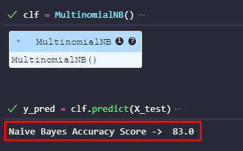
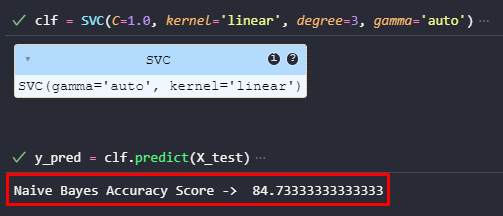
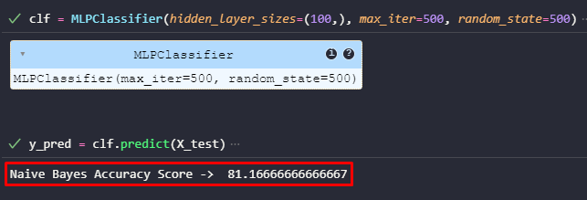

# Algoritmos para clasificación de textos

## Configuración inicial

- Crea un entorno virtual
    ```bash
    python -m virtualenv venv
    ```

- Instala las dependencias
    ```bash
    python pip install -r requirements.txt
    ```

## Resultados obtenidos

- Con el algoritmo Naive Bayes, se obtuvo un accuracy de 83%.
    

- Con el algoritmo de maquinas de soporte vectorial, se obtuvo un accuracy de 84.73%.
    

- Con el algortimo de Perceptron Multicapa, se obtuvo un accuracy de 81.17%
    

## Referencias

- [MultinomialNB](https://scikit-learn.org/1.5/modules/generated/sklearn.naive_bayes.MultinomialNB.html)
- [SVC](https://scikit-learn.org/1.5/modules/generated/sklearn.svm.SVC.html#sklearn.svm.SVC)
- [MLPClassifier](https://scikit-learn.org/1.5/modules/generated/sklearn.neural_network.MLPClassifier.html)